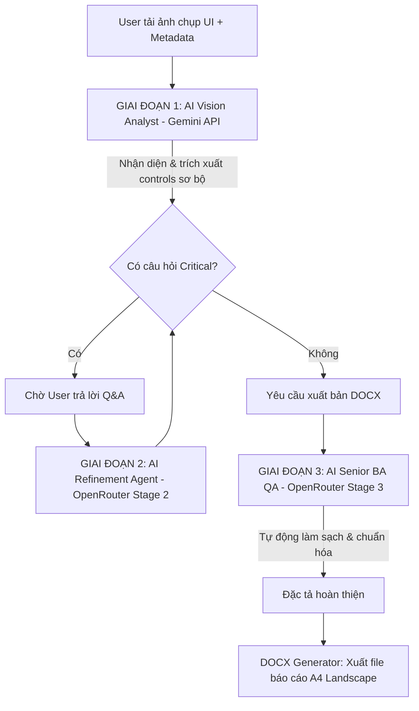

# QUY TRÌNH LUỒNG XỬ LÝ AI - SCREEN-TO-SPEC BA AGENT

Tài liệu này đặc tả chi tiết quy trình xử lý đa giai đoạn (Multi-stage AI Workflow) được nâng cấp và triển khai trong dự án **Screen-to-Spec BA Agent**. Hệ thống sử dụng mô hình trí tuệ nhân tạo thị giác (Vision AI) kết hợp với các mô hình suy luận (Reasoning Agent) qua OpenRouter và các luật thẩm định tự động để chuyển đổi ảnh chụp giao diện (UI Screenshot) thành tài liệu đặc tả nghiệp vụ phần mềm (DOCX Specification) chuẩn chỉnh.

---

## I. Sơ đồ Luồng Nghiệp Vụ Tổng Thể

Hệ thống xử lý thông tin thông qua **3 Giai đoạn AI chính** sử dụng các nguồn API key và mô hình riêng biệt:

---

## II. Đặc Tả Chi Tiết 3 Giai Đoạn Xử Lý AI

### 1. Giai đoạn 1: Phân tích ảnh chụp UI sơ bộ (Initial Screenshot Analysis)
*   **Tác nhân thực hiện (Role)**: **AI Business Analyst (Vision AI)**
*   **API & Mô hình**: Sử dụng native **Gemini API** (`GEMINI_API_KEY` trong `.env`), model mặc định là `gemini-2.5-flash`.
*   **Hàm gọi**: `AIService.analyze_screenshot()`
*   **System Prompt sử dụng**: `_build_stage1_prompt()` tích hợp `_build_common_ba_control_rules()`
*   **Nhiệm vụ chi tiết**:
    1.  **OCR & Phân tích cấu trúc thị giác**: Nhận diện toàn bộ text và bố cục màn hình từ ảnh chụp thiết kế UI.
    2.  **Trích xuất danh sách Controls sơ bộ**: Nhận diện các logical controls nghiệp vụ (không tách riêng lẻ các UI element phụ thuộc).
    3.  **Lập tóm tắt màn hình**: Điền thông tin vào `screen_summary` mô tả chức năng nghiệp vụ tổng quát của màn hình.
    4.  **Đặt câu hỏi làm rõ (Q&A)**: Phân loại câu hỏi làm rõ theo độ ưu tiên (`critical`, `important`, `optional`). Nếu còn câu hỏi `critical` chưa được trả lời, `ready_to_generate_docx` tự động đặt là `false`.
    5.  **Đưa ra giả định (Assumptions)**: Liệt kê các giả định nghiệp vụ kèm mức độ rủi ro (`high`, `medium`, `low`).

---

### 2. Giai đoạn 2: Tinh chỉnh đặc tả sau Q&A (Validate & Brainstorm - Reasoning Agent)
*   **Tác nhân thực hiện (Role)**: **AI Refinement Agent (Reasoning Agent)**
*   **API & Mô hình**: Gọi qua **OpenRouter Stage 2 API** (`OPENROUTER_API_KEY_STAGE2`), model mặc định là `google/gemini-2.5-pro` (hoặc cấu hình tùy ý trong `.env`).
*   **Hàm gọi**: `AIService.refine_specification()`
*   **System Prompt sử dụng**: `_build_stage2_prompt()` tích hợp `_build_common_ba_control_rules()`
*   **Nhiệm vụ chi tiết**:
    1.  **Hội nhập thông tin**: Phân tích sâu các câu trả lời của User để validate, cập nhật và làm giàu quy tắc nghiệp vụ.
    2.  **Gộp & Chuẩn hóa Logical Controls**: Tiến hành gộp toàn bộ label, input, placeholder, icon, helper text đang bị tách rời thành một dòng logical control duy nhất (ví dụ: gộp "Label Email" và "Input Email" thành "Trường nhập Email").
    3.  **Cập nhật trạng thái**: Các thông tin đã xác nhận được gán `source = 'user_confirmed'` và tăng `confidence`.
    4.  **Phát hiện Gap mới**: Nếu cần thiết, tiếp tục đặt câu hỏi làm rõ bổ sung. Nếu không còn câu hỏi critical, tự động set `ready_to_generate_docx = true`.

---

### 3. Giai đoạn 3: Kiểm soát chất lượng trước khi xuất bản (Pre-DOCX QA Validation)
*   **Tác nhân thực hiện (Role)**: **AI Senior BA QA (QC Agent)**
*   **API & Mô hình**: Gọi qua **OpenRouter Stage 3 API** (`OPENROUTER_API_KEY_STAGE3`), model mặc định là `google/gemini-2.5-pro` (hoặc cấu hình tùy ý trong `.env`).
*   **Hàm gọi**: `AIService.qa_check_specification()`
*   **System Prompt sử dụng**: `_build_stage3_prompt()` (tức Pre-DOCX QA Prompt) tích hợp `_build_common_ba_control_rules()`
*   **Nhiệm vụ chi tiết**:
    Hoạt động như một kiểm định viên độc lập ngay trước khi file Word được tạo ra nhằm đảm bảo chất lượng đặc tả cao nhất:
    1.  **Kiểm tra tính logic nghiệp vụ**: Đảm bảo toàn bộ rows được mô tả theo logical business control, gộp sạch các UI element rời rạc bị sót.
    2.  **Đánh lại STT**: Đảm bảo số thứ tự bắt đầu từ 1 và liên tục tăng, không nhảy số.
    3.  **Loại bỏ trùng lặp**: Gộp hoặc xóa các dòng control bị trùng tên.
    4.  **Kiểm tra tính nhất quán**:
        *   *Input Field*: Phải có đầy đủ validation, required, min/max length, format, error message, business rule và acceptance criteria.
        *   *Output Field*: Tránh mô tả các rule nhập liệu không liên quan; chỉ tập trung vào nguồn dữ liệu, format hiển thị, thời điểm cập nhật và công thức tính.
    5.  **Ghi chú xác nhận**: Ghi rõ `[Cần xác nhận]` đối với các thông tin còn chưa chắc chắn.

---

## III. Cấu Trúc Schema Control Row (rows)

Để tối ưu hóa tính ổn định và tự động kiểm tra, cấu trúc của mỗi control row (`rows`) được nâng cấp bao gồm:

| Cột (Key) | Kiểu dữ liệu | Ý nghĩa đặc tả nghiệp vụ |
| :--- | :--- | :--- |
| `stt` / `STT` | `Integer` | Số thứ tự tăng dần liên tục, bắt đầu từ 1 |
| `control_name` | `String` | Tên logical control nghiệp vụ (Ví dụ: `Trường nhập Email`, `Dropdown Trạng thái đơn hàng`) |
| `control_type` | `String` | Loại control nghiệp vụ (Ví dụ: `Textbox`, `Dropdown`, `Button`, `Table/Grid`, `Output`, etc.) |
| `data_type` | `String` | Kiểu dữ liệu tương ứng (Ví dụ: `Email/String`, `Currency/Number`, `Date`, etc.) |
| `io` | `String` | Hướng dữ liệu: `Input`, `Output`, hoặc `Input/Output` |
| `initial_value` | `String` | Giá trị khởi tạo / Giá trị mặc định |
| `description` | `String` | Mô tả hành vi chi tiết có cấu trúc (Mục đích, Hiển thị, Dữ liệu, Validation, AC, etc.) |
| `confidence` | `Float` | Độ tin cậy từ `0.0` đến `1.0` |
| `source` | `String` | Nguồn gốc thông tin: `visible`, `inferred`, hoặc `user_confirmed` |

---

## IV. Quy Trình Hậu Kỳ Tự Động (Post-processing & Export)

Sau khi AI QC hoàn tất, hệ thống thực thi hai bộ lọc tĩnh (Static rules) trước khi xuất bản file báo cáo:
1.  **Validator tĩnh (`SpecValidator.validate_full_spec`)**:
    *   Tự động phát hiện trùng lặp tên control và thêm hậu tố phân biệt.
    *   Tự động khóa tính năng xuất file chính thức nếu còn câu hỏi `critical` chưa được trả lời (chỉ cho phép xuất file nháp - Draft).
2.  **Bộ sinh DOCX (`DOCXGenerator`)**:
    *   Căn lề trên khổ giấy **A4 Landscape** (Xoay ngang), phông chữ **Times New Roman cỡ 12**, giãn cách dòng **1.3**.
    *   Chèn hình ảnh UI Mockup căn giữa ở trên cùng để người xem dễ dàng đối chiếu trực quan.
    *   Lưu trữ kết quả trực tiếp ra ngoài thư mục `code/download` của dự án kèm ngày giờ xuất bản độc lập.
